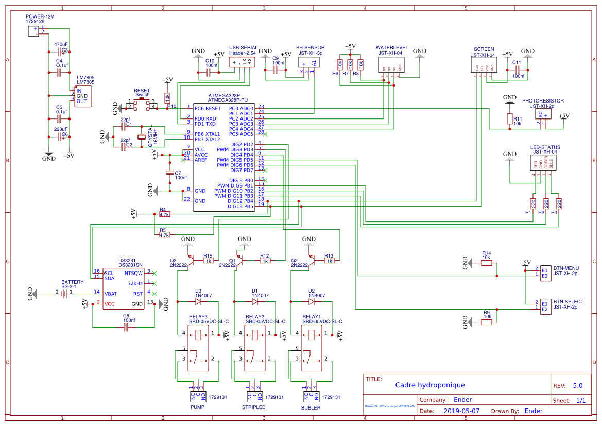

# hydroponic_frame

## Todo
- [ ] Terminer le readme
- [ ] Terminer le code 
  - [ ] gestion de l'éclairage des plantes
  - [ ] gestion des menus
  - [ ] sauvegarde des paramètres dans l'EEPROM
- [ ] Terminer plan de montage
- [ ] Multilingue

## Matériel

### Electronique
- 1 * Atmega328p-pu
- 1 * Crystal 16Mhz
- 1 * LM7805
- 1 * Condensateur électrolytique 470uf
- 1 * Condensateur électrolytique 220uf
- 1 * Switch smd
- 3 * Connecteur JST-XH 2p
- 1 * Connecteur JST-XH 3p
- 4 * Connecteur JST-XH 4p
- 1 * Puce DS3231
- 1 * Support baterie CR2032
- 3 * Relais SRD-05VDC-SL-C
- 3 * Diode 1N4007
- 3 * Transistor 2N2222
- 2 * Condensateur céramique 0.1uf
- 2 * Condensateur céramique 22pf
- 5 * Condensateur céramique 100nf
- 3 * Résistance smd 1206 220 ohm
- 3 * Résistance smd 1206 1 kohm
- 2 * Résistance smd 1206 4.7 kohm
- 1 * Bornier à vis 2p
- 3 * Bornier à vis 3p

### Cadre hydroponique
- 1 * plache contreplaqué ep 18mm, l500mm, L518mm
- 2 * plache contreplaqué ep 18mm, l138mm, L500mm
- 2 * plache contreplaqué ep 18mm, l82mm, L120mm
- 1 * plache contreplaqué ep 18mm, l82mm, L340mm
- 1 * plache contreplaqué ep 18mm, l82mm, L160mm
- 1 * tube PVC d100mm, L500mm
- 4 * pot de fleur d75, h70
- 1 * plaque aluminium ep1mm, l38mm, L80mm

### Matériel divers
- Vis bois
- Colle à bois
- Buller
- Alimentation 12V
- Interrupteur on/off
- Prise 

## Schémas électronique
Tous les schémas sont disponible dans le dossier "**electronic**"

- Schéma électronique
- Schéma des pistes du PCB
- Fichier zip contenant les fichiers gerber pour commander le PCB

